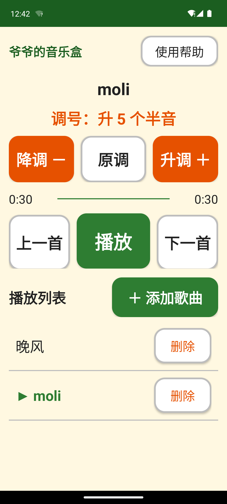

# 爷爷的音乐盒 🎵

一款专门为老人设计的安卓音乐播放器：**大字、大按钮、升降调**。
听伴奏、听音乐，跟着唱的时候可以把伴奏**升高或降低几个半音**，调到适合自己的音域。

> 起因：市面上播放器都太商业化，老人只想简简单单听歌、唱戏、跟着伴奏唱歌。
> 这个应用只有一屏，没有任何广告、登录、推荐和会员。

| 播放中 | 升降调 + 播放列表 |
| --- | --- |
|  |  |

## 功能

| 功能 | 说明 |
| --- | --- |
| 从微信导入歌曲 | 在微信里点开音乐 → 右上角「···」→「用其他应用打开」→ 选「爷爷的音乐盒」 |
| 播放列表 | 已导入的歌曲全部在列表里，点哪首放哪首，可删除 |
| 上一首 / 下一首 | 一个按钮切歌 |
| 播放 / 暂停 | 全屏最大的绿色按钮 |
| **半音升降调** | 「升调 ＋」「降调 －」每次变一个半音（±12 个半音内），「原调」一键恢复；**变调不变速**，伴奏速度不改变 |
| 后台播放 | 熄屏、切到微信都继续放，锁屏/通知栏也能控制，拔耳机自动暂停 |

界面全部为大字体（22sp～34sp）、大按钮（84dp～100dp 高）、高对比暖色配色，专为老人设计。

## 技术方案

- **语言/UI**：Java + Android 原生 View（不引重框架，APK 小、老机器跑得动）
- **播放内核**：[AndroidX Media3 / ExoPlayer](https://github.com/androidx/media) 1.4.1
  - 升降调用 `PlaybackParameters(speed, pitch)`，`pitch = 2^(半音数/12)`
  - 内置 [Sonic 音频算法](https://github.com/waywardgeek/sonic)（Bill Cox 的开源“变调不变速”库，ExoPlayer 官方音频处理器即基于它）
- **后台播放**：Media3 `MediaSessionService` + 媒体通知，自动处理音频焦点
- **微信导入**：注册 `ACTION_VIEW` / `ACTION_SEND` intent-filter，把 `content://` 流拷贝进应用私有目录，**不需要任何存储权限**
- **最低支持**：Android 7.0（API 24），兼容老人手里的旧手机

### 参考资料（GitHub）

- [androidx/media](https://github.com/androidx/media) — Media3/ExoPlayer 官方仓库（`PlaybackParameters` 支持独立 pitch 调节）
- [waywardgeek/sonic](https://github.com/waywardgeek/sonic) — Sonic 变调不变速算法原始实现
- [Audio damping/quality 参考] SoundTouch（GPL，未采用，Media3 内置 Sonic 已足够）

## 自己构建

```bash
# 需要 JDK 17 和 Android SDK（platforms;android-34, build-tools;34.0.0）
./gradlew assembleRelease     # 产出 app/build/outputs/apk/release/app-release.apk
./gradlew test                # 跑单元测试（半音换算等）
```

发布签名：把 `keystore/keystore.properties`（含 storeFile/storePassword/keyAlias/keyPassword）与 keystore 文件放到项目 `keystore/` 目录即可，该目录已 gitignore。

## 安装到老人手机（3 步）

1. 把 `app-release.apk` 通过微信“文件传输助手”发到老人手机
2. 手机上点开这个 APK，允许“安装未知应用”
3. 装好后打开桌面上的橙色音符图标「爷爷的音乐盒」

详细图文步骤见 [安装指南.md](安装指南.md)，打印版大字说明见 [使用说明-打印版.html](使用说明-打印版.html)。

## 项目结构

```
app/src/main/java/com/greenhome/musicbox/
├── MainActivity.java    # 主界面：列表、播放控制、升降调、微信导入
├── PlaybackService.java # 后台播放服务（MediaSessionService + ExoPlayer）
├── PlaylistStore.java   # 播放列表/进度/调号的本地持久化
├── SongAdapter.java     # 歌曲列表适配器
├── PitchUtils.java      # 半音 ↔ pitch 换算
└── Song.java            # 歌曲数据类
```
